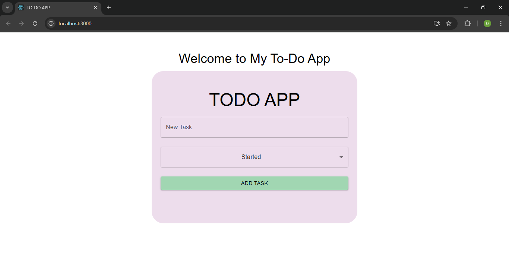
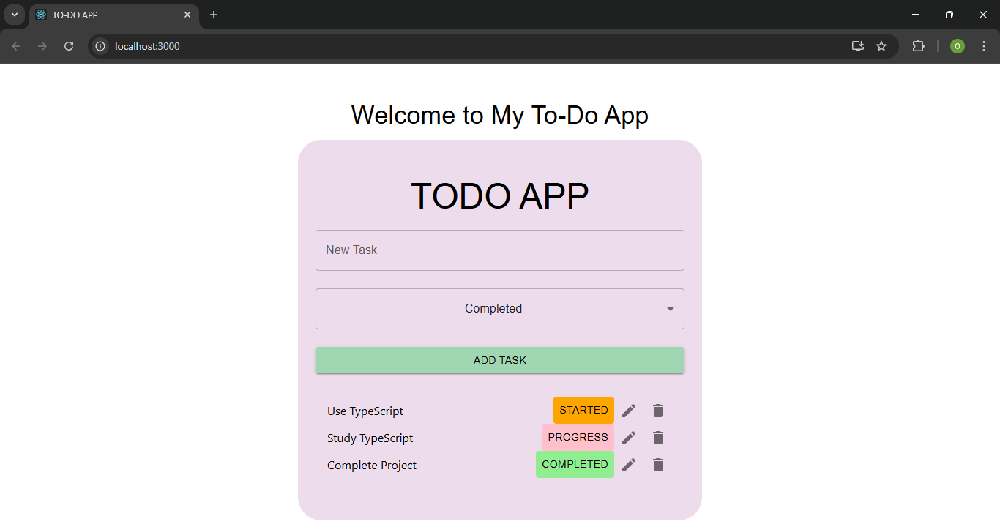

# To-Do App (Frontend - React.js)

## Project Overview
This is the frontend of a simple **To-Do App** built using **React.js**. The application allows users to:
- View all tasks.
- Add new tasks.
- Edit existing tasks.
- Delete tasks.
- Manage their to-do list easily.

## Technologies Used
- **React.js** (TypeScript)
- **Material UI** (for styling)
- **Vite** (for project setup)

## Screenshots
### 1. Home Page View


### 2. Add Task Page View


## Getting Started
### 1. Clone the Repository
```sh
git clone https://github.com/Kishore1245/ToDo-App.git
cd ToDo-App
```

### 2. Install Dependencies
```sh
npm install
```

### 3. Run the Application
```sh
npm run dev
```

The app will be available at **http://localhost:5173/** (if using Vite).

## Repository Link
[GitHub Repository](https://github.com/Kishore1245/ToDo-App)